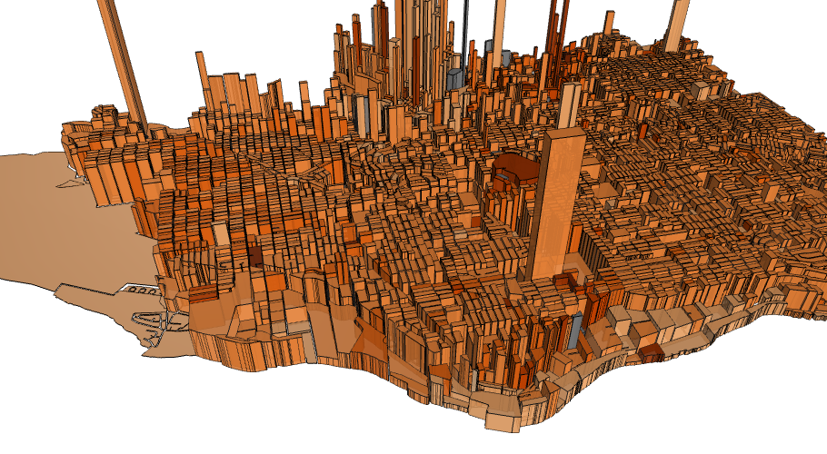

<!-- README.md is generated from README.Rmd. Please edit that file -->
r-deckgl: An R Interface to deck.gl
===================================

[](https://cran.r-project.org/package=deckgl) [](https://github.com/crazycapivara/deckgl/releases/latest) [](https://travis-ci.org/crazycapivara/deckgl) [](https://www.repostatus.org/#active) [](https://github.com/uber/deck.gl/releases/tag/v8.1.4)

The r-deckgl package makes the open-source JavaScript library [deck.gl](https://deck.gl/) available within R via the [htmlwidgets](https://www.htmlwidgets.org/) package.



Installation
------------

``` r
install.packages("deckgl")
```

You can install the latest version of r-deckgl from github with:

``` r
# install.packages("remotes")
remotes::install_github("crazycapivara/deckgl")
```

Quickstart
----------

``` r
library(deckgl)
```

Create a `deckgl` instance:

``` r
deckgl()
```

Add a basemap:

``` r
deckgl() %>%
  add_basemap()
```

Add any kind of layers:

``` r
# Grid layer example
data("sf_bike_parking")

props <- list(
  extruded = TRUE,
  cellSize = 200,
  elevationScale = 4,
  getPosition = ~lng + lat,
  tooltip = "Count: {{count}}"
)

deckgl(zoom = 11, pitch = 45) %>%
  add_basemap() %>%
  add_grid_layer(
    data = sf_bike_parking,
    properties = props
  )
```

The `deckgl` Instance
---------------------

The `deckgl` function creates the widget / renderer to which you add layers and other configuration parameters:

``` r
rdeck <- deckgl(
  latitude = 37.8,
  longitude = -122.45,
  zoom = 12
) %>%
  add_grid_layer(
    data = data,
    properties = props
  )
```

Layers
------

Due to the generic function `add_layer` any kind of layer defined in the [deck.gl Layer Catalog](https://github.com/uber/deck.gl/tree/master/docs/layers#deckgl-layer-catalog-overview) is supported. The layer type is chosen via the `class_name` parameter, e. g. `ScatterplotLayer` or `GeoJsonLayer`. Usually you will not use the generic function but one of the `add_*_layer` shortcuts instead:

``` r
# Generic function
deckgl() %>%
  add_layer("ArcLayer", id, data, properties)

# Shortcut function
deckgl() %>%
  add_arc_layer(id, data, properties)
```

Data
----

The `data` parameter can either be an url to fetch data from or a data object. In most cases you will pass an object of type `data.frame` to the layers. Use the formula syntax to define data accessors that deck.gl uses to access the properties of the data object:

``` r
props <- list(
  getPosition = ~lng + lat
  # ...
)
```

### `sf` Data Objects

An object of class [sf](https://github.com/r-spatial/sf) is a `data.frame` with a geometry list-column. Set the layer prop that fetches the geometry to the geometry list-column of your `sf` object:

``` r
# Example: PolygonLayer

props <- list(
  getPolygon = ~geometry
  # ...
)
```

### Sources

With `add_source` you can add a source to the widget that can be used accross layers:

``` r
data("bart_stations")

deckgl() %>%
  add_source("bart-stations", bart_stations) %>%
  add_scatterplot_layer(
    source = "bart-stations",
    getPosition = ~lng + lat,
    # ...
  ) %>%
  add_text_layer(
    source = "bart-stations",
    getPosition = ~lng + lat,
    # ...
  ) %>%
  add_basemap()
```

Please note that you use the parameter `source` instead of `data`.

Layer Props
-----------

Layer properties are passed to the `add_*_layer` functions either as named list by the `properties` argument or as named parameters / keyword arguments via the `...` parameter. The names correspond to the properties of the deck.gl counterparts. Therefore, please see the [deck.gl Layer Catalog](https://github.com/uber/deck.gl/tree/master/docs/layers#deckgl-layer-catalog-overview) to determine the available parameters for the used layer. You can also pass a props list and keyword arguments together. Identical properties are overwritten by the latter ones.

[Grid Layer](https://deck.gl/#/documentation/deckgl-api-reference/layers/grid-layer) example:

``` javascript
// JavaScript code

const layer = new GridLayer({
  id: "grid-layer",
  data: data,
  extruded: true,
  cellSize: 200,
  elevationScale: 4,
  getPosition: d => [d.lng, d.lat]
});
```

``` r
# Corresponding R code

# using named arguments
deck <- deckgl() %>%
  add_grid_layer(
    id = "grid-layer",
    data = data,
    extruded = TRUE,
    cellSize = 200,
    elevationScale = 4,
    getPosition = ~lng + lat
  )

# ... using a named props list
props <- list(
  cellSize = 200,
  extruded = TRUE,
  # ...
)

deckgl() %>%
  add_grid_layer(
    data = data,
    properties = props
  )
```

### Camels or Snakes

According to the style conventions in R, `camelCased` parameters in deck.gl can also be passed as `snake_cased` parameters in R. For example, `getPosition` can be passed to deck.gl as `get_position`:

``` r
deckgl() %>%
  add_grid_layer(
    get_position = ~lng + lat,
    cell_size = 200,
    # ...
    
  )
```

### Data Accessors

Use the formula syntax to define data accessors:

``` r
props <- list(
  getPosition = ~lng + lat # js: d => [d.lng, d.lat]
  getFillColor = ~color # js: d => d.color
  # ...
)
```

The example above assumes that your data contains the columns `lng`, `lat` and `color`.

It is also possible to pass JavaScript code by using the `JS` function in R:

``` r
props <- list(
  getColor = JS("d => d.capital ? [140, 10, 10] : [60, 10, 10]")
  # ...
)
```

### Colors

In deck.gl colors are represented by `[r, g, b, a]` arrays. In R you can pass hex color codes or color names to all color props of the `add_*_layer` functions. They are automatically converted to the required format:

``` r
deckgl() %>%
  add_grid_layer(
    colorRange = RColorBrewer::brewer.pal(6, "Blues"),
    # ...
  )
```

Tooltips
--------

The tooltip for a layer can be set via the `tooltip` parameter. You can either pass a single template string or a list with the following properties (see also `use_tooltip`):

-   `html`: A template string that will be set as the `innerHTML` of the tooltip.
-   `style`: A `cssText` string that will modefiy the default style of the tooltip.

### Tooltip Template Syntax

The tooltip string is a so called "mustache" template in which variable names are identified by the double curly brackets that surround them. The variable names available to the template are given by deck.gl’s [pickingInfo.object](https://github.com/visgl/deck.gl/blob/master/docs/developer-guide/interactivity.md#the-picking-info-object) and vary by layer.

[Arc Layer](https://deck.gl/#/documentation/deckgl-api-reference/layers/arc-layer) example:

``` r
data("bart_segments")

props <- list(
  getWidth = 12,
  getSourcePosition = ~from_lng + from_lat,
  getTargetPosition = ~to_lng + to_lat,
  getSourceColor = "yellow",
  getTargetColor = "orange",
  tooltip = use_tooltip(
    html = "{{from_name}} to {{to_name}}",
    style = "background: steelBlue; border-radius: 5px;"
  )
)

deckgl(zoom = 9.5, pitch = 35) %>%
  add_arc_layer(data = bart_segments, properties = props) %>%
  add_basemap()
```

See [mustache.js](https://github.com/janl/mustache.js) for a complete syntax overwiew.

Controls
--------

Controls are displayed as overlays on top of the map / deck. Usually you can set the position and the style of the control. The most basic control is a simple text box:

``` r
deckgl() %>%
  add_basemap() %>%
  add_control(
    html = "Plain Base Map",
    pos = "top-right",
    style = "background: steelblue; color: white"
  )
```

### JSON Editor

You can add an instance of the [ace](https://ace.c9.io/) editor in JSON mode to the map by using `add_json_editor`:

``` r
deckgl() %>%
  add_grid_layer(
    # ...
  ) %>%
  add_json_editor()
```

This allows you to change your layer props on the fly. You can toggle the visibility of the editor by pressing "e".

### Legends

With `add_legend` you can add a custom legend to your widget:

``` r
deckgl() %>%
  add_basemap() %>%
  add_legend(
    colors = c("yellow", "orange"),
    labels = c("Cake", "Icecream"),
    title = "Sweets"
  )
```

In most cases, you will create the legend automatically using a palette function:

``` r
data_column <- 1:10
pal <- scales::col_bin("Blues", data_column, bins = 5)
deckgl() %>%
  add_basemap() %>%
  add_legend_pal(pal, title = "Blues")
```

Basemaps
--------

By default, `add_basemap` adds a [carto basemap](https://carto.com/developers/carto-vl/reference/#cartobasemaps) to the widget.

To use basemaps from [mapbox](https://www.mapbox.com/maps/) it is recommended that you store your API access token in an environment variable called `MAPBOX_API_TOKEN`:

``` r
# If not set globally
#Sys.setenv(MAPBOX_API_TOKEN = "xyz")

deckgl() %>%
  add_mapbox_basemap("mapbox://styles/mapbox/light-v9")
```

Run Examples
------------

You can run the [API examples](https://github.com/crazycapivara/deckgl/tree/master/inst/examples/deckgl-api-reference) from the `add_*_layer` functions with `example(add_*_layer)`:

``` r
example(add_grid_layer)
```

Shiny Integration
-----------------

With the `renderDeckgl` and `deckglOutput` functions you can use r-deckgl in shiny applications:

``` r
library(shiny)
library(deckgl)

backend <- function(input, output) {
  output$rdeck <- renderDeckgl({
    deckgl() %>%
      add_grid_layer(
        data = sf_bike_parking,
        getPosition = ~lng + lat,
        cellSize = 400,
        pickable = TRUE
      ) %>%
    add_basemap()
  })
}

frontend <- fluidPage(
  deckglOutput("rdeck")
)

shinyApp(frontend, backend)
```

To update a `deckgl` instance use `deckgl_proxy` in combination with `update_deckgl`.

Furthermore, the `onclick` event sends deck.gl’s [picking info object](https://github.com/visgl/deck.gl/blob/master/docs/developer-guide/interactivity.md#the-picking-info-object) to your shiny application and updates the corresponding input in the form of `input$widget_id_onclick`. For example, if the widget id is `rdeck`, you can access the `pickingInfo` object with `input$rdeck_onclick`:

``` r
backend < -function(input, output) {
  # ...
  observeEvent(input$rdeck_onclick, {
    info <- input$rdeck_onclick
    print(info$object)
  })
}
```

Development
-----------

The JavaScript library of r-deckgl uses [webpack](https://webpack.js.org/) as module bundler. Therefore, you need [node.js](https://nodejs.org) to build the module. All JavaScript code is located in the `javascript/src` folder and test components go to `javascript/src/test-components`.

Install deps and build the library from inside the `javascript` folder with:

``` bash
npm install

npm run build
```

To spin up the [webpack-dev-server](https://github.com/webpack/webpack-dev-server) run:

``` bash
npm run start
```

Documentation
-------------

-   [r-deckgl pkgdown Site](https://crazycapivara.github.io/deckgl/)
-   [Example Scripts](https://github.com/crazycapivara/deckgl/tree/master/_examples)
-   [deck.gl JavaScript API Reference](https://deck.gl/#/documentation/deckgl-api-reference)

Note
----

If the `deckgl` widget is not visible in the viewer pane of RStudio, just open it in your browser by clicking "Show in new window" and everything will be fine.
