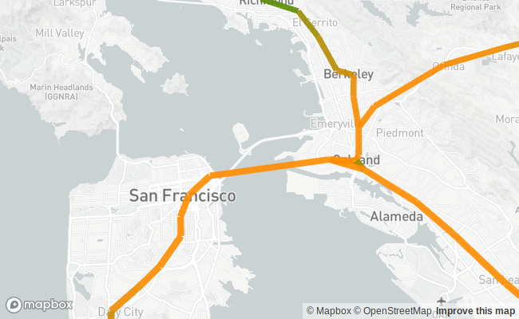

LineLayer
=========



``` r
sample_data <- paste0(
  "https://raw.githubusercontent.com/",
  "uber-common/deck.gl-data/",
  "master/website/bart-segments.json"
)

properties <- list(
  pickable = TRUE,
  getStrokeWidth = 12,
  getSourcePosition = get_property("from.coordinates"),
  getTargetPosition = get_property("to.coordinates"),
  getColor = JS("d => [Math.sqrt(d.inbound + d.outbound), 140, 0]"),
  getTooltip = JS("object => `${object.from.name} to ${object.to.name}`")
)

deckgl(zoom = 10, pitch = 20) %>%
  add_line_layer(data = sample_data, properties = properties) %>%
  add_mapbox_basemap()
```
