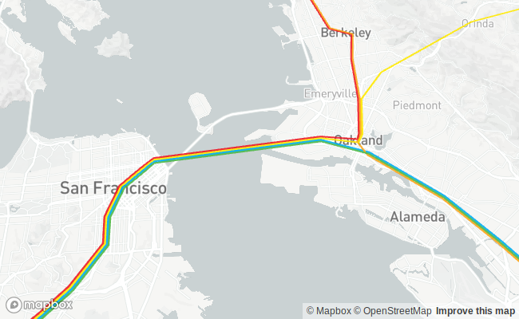

PathLayer
=========



``` r
sample_data <- paste0(
  "https://raw.githubusercontent.com/",
  "uber-common/deck.gl-data/master/",
  "website/bart-lines.json"
)

properties <- list(
  pickable = TRUE,
  widthScale = 20,
  widthMinPixels = 2,
  getPath = get_property("path"),
  # getColor = JS("d => deckglWidget.colorToRGBArray(d.color)"),
  getColor = get_color_to_rgb_array("color"),
  getWidth = 5,
  getTooltip = get_property("name")
)

deckgl(pitch = 25, zoom = 10.5) %>%
  add_path_layer(data = sample_data, properties = properties) %>%
  add_mapbox_basemap()
```
